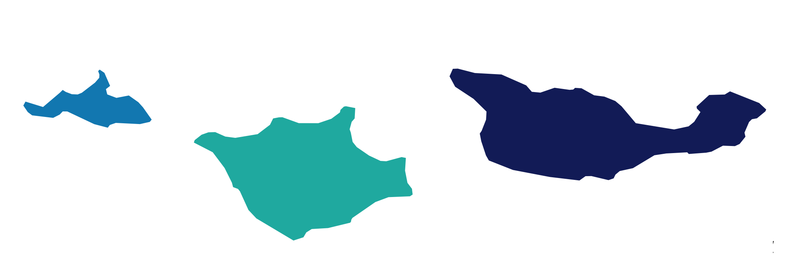

```{r setup, include=FALSE}
knitr::opts_chunk$set(echo = FALSE)
```

<style type="text/css">
body{ font-size: 20px; max-width: 1600px; margin: auto; padding: 1em; }
code.r{ font-size: 18px; }
p { padding-top: 10px; padding-bottom: 10px; }
pre { font-size: 16px; }
</style>

{ width=60% }

#### *Channel Islands, Santa Barbara*

## __________________________________________________________

## Finite Mixture, Latent Variable, & Structural Equation Modeling 

## __________________________________________________________

### About me: 

I am a Ph.D student at the University of California, Santa Barbara. My work focuses on applied quantitative methods and finite mixture models in-line with my advisor Dr. Karen Nylund-Gibson's research. I participate in UCSB's Latent Variable Group. https://lvgucsb.weebly.com/ 

## Workflow focus on reproducibility:

- The R package {`MplusAutomation`} is used for creating organized project workflows (Hallquist & Wiley, 2018)
- All models are estimated in Mplus allowing for highly flexible SEM model specification (Muthén & Muthén, 1998-2017)
- R-Projects and the {`here`} package allow for reproducibility across operating systems.
- The {`tidyverse`}'s highly coherent functions are used whenever possible to increase accessibility for applied audiences (Wickham et al., 2019)

## __________________________________________________________

### Why MplusAutomation?

$\color{blue}{\text{Why not ...}}$

a. do S.E.M. modeling using packages within R? 

- Currently, most S.E.M. packages in R such as {`lavaan`} have significant limitations in their capacity for flexibly specifying the full range modeling approaches available in S.E.M. This includes the ability to specify categorical latent variables (LCA/LPA/LTA), multi-level models (MLM), non-normal outcomes (GLM), and their combinations (i.e., multi-level LTA with covariates & distals). 

- Other packages, although highly flexible {`OpenMX`} are less accessible to applied researchers. 

b. do S.E.M. modeling entirely in Mplus? 

- Running complex models in Mplus is error prone due to the workflow involving a proliferation of files and reliance on other software (Excel, SPSS). 
- In practice, this results in organizational challenges and lots of copying and pasting.
- Importantly, Mplus does not provide convenient methods for conducting fully reproducible research projects. 
- In R documenting all research decisions and data presentation is straightforward from start to finish (e.g., data cleaning, transformation, re-coding, plotting, and table construction).

## __________________________________________________________

## Lab materials: Applied Mixture modeling (UCSB, ED 201F) 

- Lab 1: [Tidy Enumeration with MplusAutomation - Latent Class Analysis (LCA)](https://garberadamc.github.io/project-site/lca-enumeration)
- Lab 2:
- Lab 3:
- Lab 4:
- Lab 5:

## Lab materials: Factor Analysis  (UCSB, ED 216B) 

- Lab 1: [Getting Started with MplusAutomation - Explore and Prepare Data. Run Models.](https://garberadamc.github.io/project-site/explore-prepare-mplus-auto)
- Lab 2: [Exploratory Factor Analysis (EFA) - Univariate and Multivariate Diagnostics.](https://garberadamc.github.io/project-site/Lab2-EFA)
- Lab 3: [EFA - R coding excercise: What's Missing?](https://garberadamc.github.io/project-site/Lab3-EFA-what-s-missing)
- Lab 4: [Splitting samples, Iterators, and Dealing with Large Datasets](https://garberadamc.github.io/project-site/Lab4-school-trouble)
- Lab 5: [EFA Rotation - Confirmatory Factor Analysis (CFA) - Path Diagrams](https://garberadamc.github.io/project-site/Lab5-rotation-efa)
- Lab 6: [CFA *Roulette* - A Game of Chance](https://garberadamc.github.io/project-site/Lab6-CFA-Roulette)
- Lab 7: 
- Lab 8: [Multiple Indicator, Multiple Causes, MIMIC Models](https://garberadamc.github.io/project-site/Lab8-MIMIC)
- Lab 9: 

<br>

## __________________________________________________________

## Replicating analyses using Tidy Workflow & MplusAutomation:

- Multi-level Latent Class Analysis (MLCA) : [Replication of examples provided in Henry, & Muthén, (2010)](https://garberadamc.github.io/project-site/mlca-demo)
- Monte Carlo Simulation of Power & Sample Size: [Replication & adaptation of examples provided in Muthén, & Muthén, (2002)](https://garberadamc.github.io/project-site/sim-power-size)
- 
- 
- 

<br>

## __________________________________________________________

## References

Hallquist, M. N., & Wiley, J. F. (2018). MplusAutomation: An R Package for Facilitating Large-Scale Latent Variable Analyses in Mplus. Structural equation modeling: a multidisciplinary journal, 25(4), 621-638.

Henry, K. L., & Muthén, B. (2010). Multilevel latent class analysis: An application of adolescent smoking typologies with individual and contextual predictors. Structural Equation Modeling, 17(2), 193-215.

Muthén, L.K. and Muthén, B.O. (1998-2017).  Mplus User’s Guide.  Eighth Edition. Los Angeles, CA: Muthén & Muthén

R Core Team (2017). R: A language and environment for statistical computing. R Foundation for Statistical Computing, Vienna, Austria. URL http://www.R-project.org/

Wickham et al., (2019). Welcome to the tidyverse. Journal of Open Source Software, 4(43), 1686, https://doi.org/10.21105/joss.01686

{ width=75% }